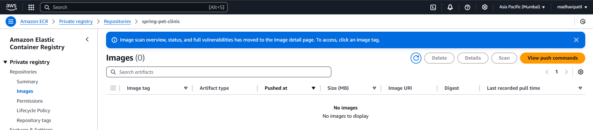
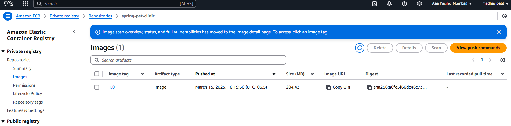
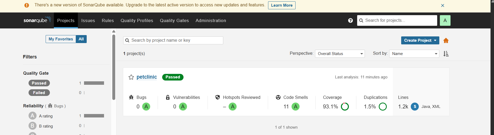
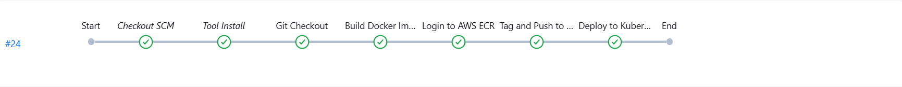

#  CI/CD Pipeline: Push Docker Image to ECR & Deploy on Kubernetes via Kubeadm using Jenkins  

This guide covers the full implementation, including server details, installations, and configurations.  


## ** Overview**
This project automates:
- **Building a Docker Image** in Jenkins
- **Pushing the Image to AWS ECR**
- **Deploying the Image to a Self-Hosted Kubernetes Cluster (Kubeadm)**

---

## *Prerequisites*
Ensure you have:
- AWS Account with IAM permissions for **ECR & EC2**
- A Jenkins Server with:
  - **Docker, AWS CLI, and Kubectl installed**
  - **Jenkins Pipeline Plugin**
  
- An EC2 instance configured as a **Kubernetes Master Node (Kubeadm)**
- Worker Nodes joined to the Kubeadm cluster

##  1. Infrastructure Setup  

| **Server Role**                | **Instance Type**  | **OS**          | **Installed Software**                            |
|--------------------------------|------------------|----------------|-------------------------------------------------|
| **Jenkins Server**             | t2.medium       | Ubuntu 22.04   | Jenkins, Docker, AWS CLI, Kubectl ,Sonar-scanner              |
| **Kubernetes Master (Kubeadm)** | t2.medium       | Ubuntu 22.04   | Kubeadm, Kubectl, Kubelet, Containerd           |
| **Kubernetes Worker(s) (Kubeadm)** | t2.medium (x2)  | Ubuntu 22.04   | Kubeadm, Kubectl, Kubelet, Containerd           |
| **ECR (AWS Service)**          | N/A             | AWS Managed    | Stores Docker Images                            |
| **Sonarqube**          | t2.small          | ubuntu 22.04    | scans the code nd checks the code quality                          |


## **🔹 Step 1: Setup AWS ECR**  

### 1️ **Create an ECR repository**  
```bash
aws ecr create-repository --repository-name my-app-repo
```

###  2️ **Authenticate Docker to AWS ECR**  
```bash
aws ecr get-login-password --region <your-region> | docker login --username AWS --password-stdin <aws_account_id>.dkr.ecr.<region>.amazonaws.com
```
Youll see the result as `Login Suceeeded!!`


### ** 1️ Create an IAM Role for EC2 with ECR Access**

1. Go to **AWS IAM Console** → **Roles** → **Create Role**
2. Select **EC2** as the trusted entity
3. Attach the policy **AmazonEC2ContainerRegistryFullAccess**
4. Name the role (e.g., `EC2ECRAccessRole`)
5. Click **Create Role**

### ** 2️ Attach the IAM Role to Your EC2 Instance**

1. Go to **EC2 Console** → **Instances**
2. Select your EC2 instance
3. Click **Actions** → **Security** → **Modify IAM Role**
4. Attach the newly created IAM role (`EC2ECRAccessRole`)

 Now, your EC2 instance can pull/push images to ECR without requiring `aws ecr get-login-password` manually! 


## **🔹 Step 3: Write the Jenkins Pipeline**

Define your Jenkins pipeline script to automate the build and deployment process. Below is an example `Jenkinsfile`:

```groovy
pipeline {
    agent any
    
    stages {
        stage('Clone Repository') {
            steps {
                git url: '<your-github-repo-url>', branch: 'main'
            }
        }
        
        stage('Build Docker Image') {
            steps {
                sh 'docker build -t spc:1.0 .'
            }
        }
        
        stage('Push to ECR') {
            steps {
                sh '''
                aws ecr get-login-password --region <your-region> | docker login --username AWS --password-stdin <your-account-id>.dkr.ecr.<your-region>.amazonaws.com
                docker tag spc:1.0 <your-account-id>.dkr.ecr.<your-region>.amazonaws.com/spc:1.0
                docker push <your-account-id>.dkr.ecr.<your-region>.amazonaws.com/spc:1.0
                '''
            }
        }
    }
}
```

Your Jenkins Pipeline is now ready to automate the build and deployment process! 
Youll see the pushed image in your AWS ECR repository as 




## **Step 4: SonarQube Integration on Jenkins (Different Server)**

This guide covers installing SonarQube using Docker on a separate server and configuring it in Jenkins via the user interface.

---

### ** 1. Setup SonarQube on a Different Server using Docker**

#### ** 1️ Install Docker (if not installed)**
1. Update the system:
   ```bash
   sudo apt update
   ```
2. Install Docker:
   ```bash
   sudo apt install -y docker.io
   ```
3. Start and enable Docker:
   ```bash
   sudo systemctl start docker
   sudo systemctl enable docker
   ```

#### ** 2️ Run SonarQube Container**
1. Start a SonarQube container:
   ```bash
   docker run -d --name sonarqube -p 9000:9000 sonarqube:lts-community
   ```
2. Wait for SonarQube to initialize (this may take a few minutes).
3. Access **SonarQube UI** at: `http://<SonarQube-Server-IP>:9000`
4. Default login credentials:
   - **Username**: `admin`
   - **Password**: `admin`

#### ** 3️ Generate SonarQube Token**
1. Log in to SonarQube.
2. Go to **My Account > Security**.
3. Click **Generate Token**, give it a name, and copy the generated token.

---

### ** 2. Configure SonarQube in Jenkins UI**

#### **1️⃣ Install SonarQube Scanner Plugin**
1. Open **Jenkins Dashboard**.
2. Navigate to **Manage Jenkins > Manage Plugins**.
3. Search for **SonarQube Scanner** and install it.
4. Restart Jenkins after installation.

#### ** 2️ Add SonarQube Server in Jenkins**
1. Go to **Manage Jenkins > Configure System**.
2. Find the **SonarQube Servers** section.
3. Click **Add SonarQube** and enter:
   - **Name**: `SonarQube`
   - **Server URL**: `http://<SonarQube-Server-IP>:9000`
   - **Authentication Token**: (paste the token you generated earlier)
4. Click **Save**.

#### ** 3️ Install SonarQube Scanner**
1. Navigate to **Manage Jenkins > Global Tool Configuration**.
2. Scroll to **SonarQube Scanner**.
3. Click **Add SonarQube Scanner** and enter:
   - **Name**: `SonarScanner`
   - **Install Automatically**: ✅ Checked
4. Click **Save**.

---

### **📌 3. Update Jenkins Pipeline for SonarQube**
Modify your Jenkins pipeline to include **SonarQube analysis**:

```groovy
pipeline {
    agent any
    environment {
        AWS_REGION = 'ap-south-1'
        ECR_REPO = '430118814498.dkr.ecr.ap-south-1.amazonaws.com/spring-pet-clinic'
        IMAGE_TAG = '1.0'
        SONAR_HOST_URL = 'http://<SonarQube-Server-IP>:9000'
    }

    stages {
        stage('Git Checkout') {
            steps {
                git branch: 'main', url: 'https://github.com/PrachiVpatil96/Jenkins-to-ECR-Automation-CICD.git'
            }
        }
        
        stage('SonarQube Analysis') {
            steps {
                withSonarQubeEnv('SonarQube') {
                    sh "mvn clean verify sonar:sonar -Dsonar.projectKey=my-app -Dsonar.host.url=$SONAR_HOST_URL"
                }
            }
        }
    }
}
```

---

### ** SonarQube Integration Complete!**
Now, Jenkins will analyze your code using SonarQube and display the results in the SonarQube UI.



## **Step 5: SelfHosted Agent (k8s Installation) 

For detailed setup instructions, check out the [K8s-LibraryManagementSystem README](https://github.com/PrachiVpatil96/K8s-LibraryManagementSystem/blob/main/ReadMe.md).
# Kubernetes Cluster Setup with Jenkins Integration

## Install Kubectl on Jenkins Machine

```bash
sudo apt update
sudo apt install curl
curl -LO https://dl.k8s.io/release/$(curl -L -s https://dl.k8s.io/release/stable.txt)/bin/linux/amd64/kubectl
sudo install -o root -g root -m 0755 kubectl /usr/local/bin/kubectl
kubectl version --client
```

---

## Part 1: Set Hostnames

### Master Node
```bash
sudo hostnamectl set-hostname K8s-Master
```

### Worker Node
```bash
sudo hostnamectl set-hostname K8s-Worker
```

---

## Part 2: Install Docker on Both Master & Worker Nodes

```bash
sudo apt-get update
sudo apt-get install -y docker.io
sudo usermod -aG docker ubuntu
newgrp docker
sudo chmod 777 /var/run/docker.sock
```

---

## Part 3: Install Kubernetes Components

### Master Node
```bash
sudo apt-get update
sudo apt-get install -y apt-transport-https ca-certificates curl gpg
curl -fsSL https://pkgs.k8s.io/core:/stable:/v1.29/deb/Release.key | sudo gpg --dearmor -o /etc/apt/keyrings/kubernetes-apt-keyring.gpg
echo 'deb [signed-by=/etc/apt/keyrings/kubernetes-apt-keyring.gpg] https://pkgs.k8s.io/core:/stable:/v1.29/deb/ /' | sudo tee /etc/apt/sources.list.d/kubernetes.list
sudo apt-get update
sudo apt-get install -y kubelet kubeadm kubectl
sudo apt-mark hold kubelet kubeadm kubectl
```

### Worker Node
```bash
sudo kubeadm init --pod-network-cidr=10.244.0.0/16
```

### Configure Kubernetes for Non-Root User
```bash
mkdir -p $HOME/.kube
sudo cp -i /etc/kubernetes/admin.conf $HOME/.kube/config
sudo chown $(id -u):$(id -g) $HOME/.kube/config
```

### Apply Flannel Network Plugin
```bash
kubectl apply -f https://raw.githubusercontent.com/coreos/flannel/master/Documentation/kube-flannel.yml
```

---

## Copy Kubernetes Config File

1. Copy the Kubernetes configuration file from master node:
   ```bash
   scp ~/.kube/config <your_local_machine>:/path/to/store/secret-file.txt
   ```
2. Save it as **secret-file.txt** in your local machine.

---

## Jenkins Integration

### Install Kubernetes Plugin in Jenkins

1. Navigate to **Manage Jenkins** → **Manage Plugins**.
2. Install the **Kubernetes Plugin**.
3. Once installed, go to **Manage Jenkins** → **Manage Credentials**.
4. Click on **Jenkins Global** → **Add Credentials**.
5. Select **Kubernetes Configuration (Kubeconfig file content)**.
6. Upload **secret-file.txt**.
7. Save the configuration.

Your Kubernetes cluster is now set up with Jenkins integration! 


Now add the deployement stage nd apply the chnages and youll see pipeline is running!!!



You can access your application as 
`http://ip-addrees-of-master-node:port`


