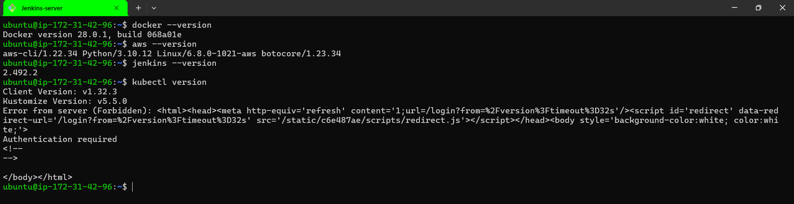

# 🚀 CI/CD Pipeline: Push Docker Image to ECR & Deploy on Kubernetes via Kubeadm using Jenkins  

This guide covers the full implementation, including server details, installations, and configurations.  


## **📌 Overview**
This project automates:
- **Building a Docker Image** in Jenkins
- **Pushing the Image to AWS ECR**
- **Deploying the Image to a Self-Hosted Kubernetes Cluster (Kubeadm)**

---

## **🔹 Prerequisites**
Ensure you have:
- AWS Account with IAM permissions for **ECR & EC2**
- A Jenkins Server with:
  - **Docker, AWS CLI, and Kubectl installed**
  - **Jenkins Pipeline Plugin**
  
- An EC2 instance configured as a **Kubernetes Master Node (Kubeadm)**
- Worker Nodes joined to the Kubeadm cluster

## 📌 1. Infrastructure Setup  

| **Server Role**                | **Instance Type**  | **OS**          | **Installed Software**                            |
|--------------------------------|------------------|----------------|-------------------------------------------------|
| **Jenkins Server**             | t2.medium       | Ubuntu 22.04   | Jenkins, Docker, AWS CLI, Kubectl               |
| **Kubernetes Master (Kubeadm)** | t2.medium       | Ubuntu 22.04   | Kubeadm, Kubectl, Kubelet, Containerd           |
| **Kubernetes Worker(s) (Kubeadm)** | t2.medium (x2)  | Ubuntu 22.04   | Kubeadm, Kubectl, Kubelet, Containerd           |
| **ECR (AWS Service)**          | N/A             | AWS Managed    | Stores Docker Images                            |
| **Sonarqube**          | t2.small          | ubuntu 22.04    | scans the code nd checks the code quality                          |


## **🔹 Step 1: Setup AWS ECR**  

### 1️⃣ **Create an ECR repository**  
```bash
aws ecr create-repository --repository-name my-app-repo
```

### 2️⃣ **Authenticate Docker to AWS ECR**  
```bash
aws ecr get-login-password --region <your-region> | docker login --username AWS --password-stdin <aws_account_id>.dkr.ecr.<region>.amazonaws.com
```
Youll see the result as `Login Suceeeded!!`


### **1️⃣ Create an IAM Role for EC2 with ECR Access**

1. Go to **AWS IAM Console** → **Roles** → **Create Role**
2. Select **EC2** as the trusted entity
3. Attach the policy **AmazonEC2ContainerRegistryFullAccess**
4. Name the role (e.g., `EC2ECRAccessRole`)
5. Click **Create Role**

### **2️⃣ Attach the IAM Role to Your EC2 Instance**

1. Go to **EC2 Console** → **Instances**
2. Select your EC2 instance
3. Click **Actions** → **Security** → **Modify IAM Role**
4. Attach the newly created IAM role (`EC2ECRAccessRole`)

✅ Now, your EC2 instance can pull/push images to ECR without requiring `aws ecr get-login-password` manually! 🚀


## **🔹 Step 3: Write the Jenkins Pipeline**

Define your Jenkins pipeline script to automate the build and deployment process. Below is an example `Jenkinsfile`:

```groovy
pipeline {
    agent any
    
    stages {
        stage('Clone Repository') {
            steps {
                git url: '<your-github-repo-url>', branch: 'main'
            }
        }
        
        stage('Build Docker Image') {
            steps {
                sh 'docker build -t spc:1.0 .'
            }
        }
        
        stage('Push to ECR') {
            steps {
                sh '''
                aws ecr get-login-password --region <your-region> | docker login --username AWS --password-stdin <your-account-id>.dkr.ecr.<your-region>.amazonaws.com
                docker tag spc:1.0 <your-account-id>.dkr.ecr.<your-region>.amazonaws.com/spc:1.0
                docker push <your-account-id>.dkr.ecr.<your-region>.amazonaws.com/spc:1.0
                '''
            }
        }
    }
}
```

✅ Your Jenkins Pipeline is now ready to automate the build and deployment process! 🚀
